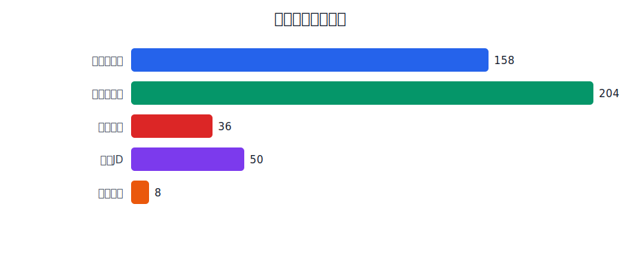
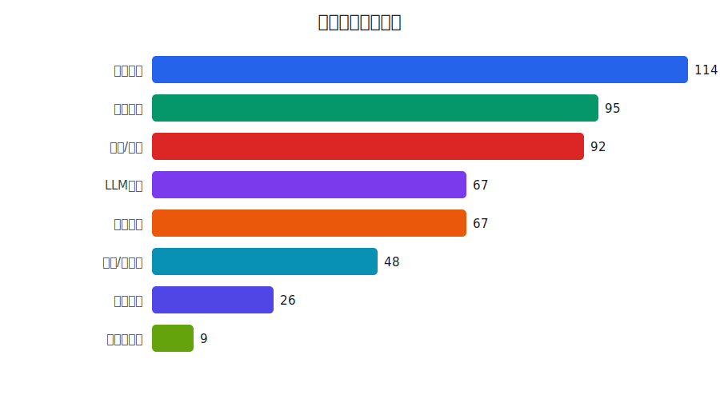
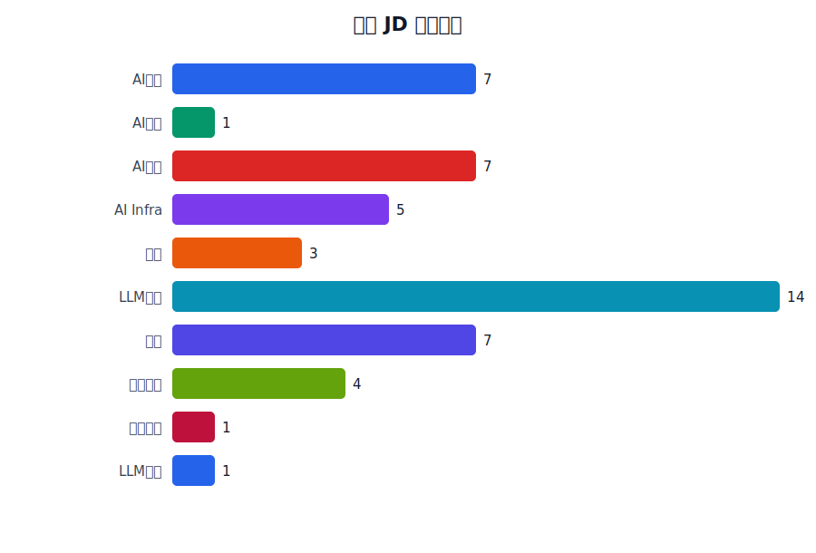
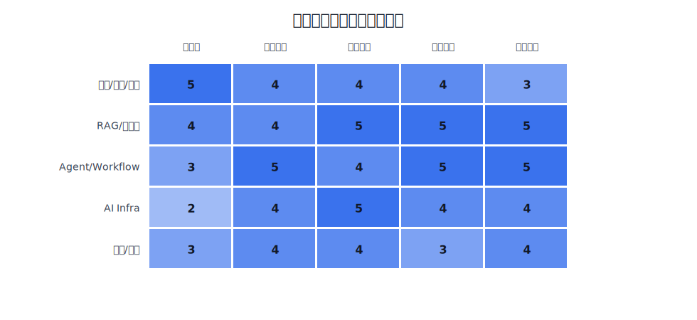
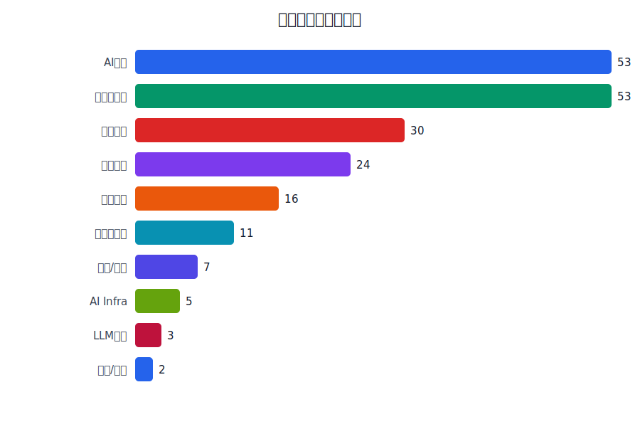
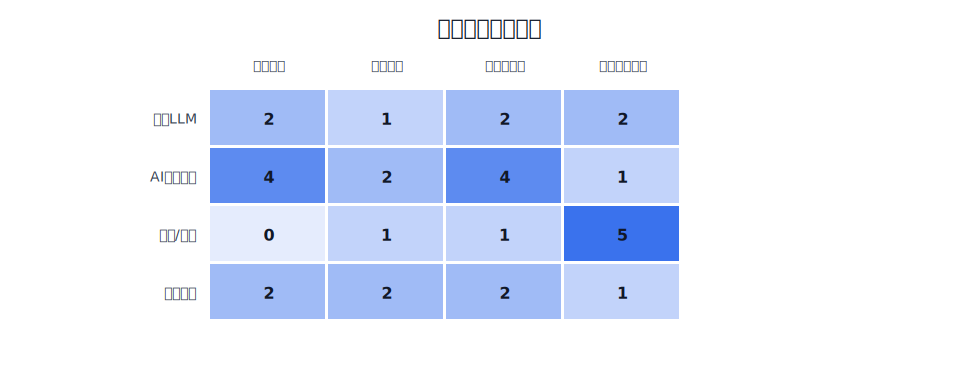
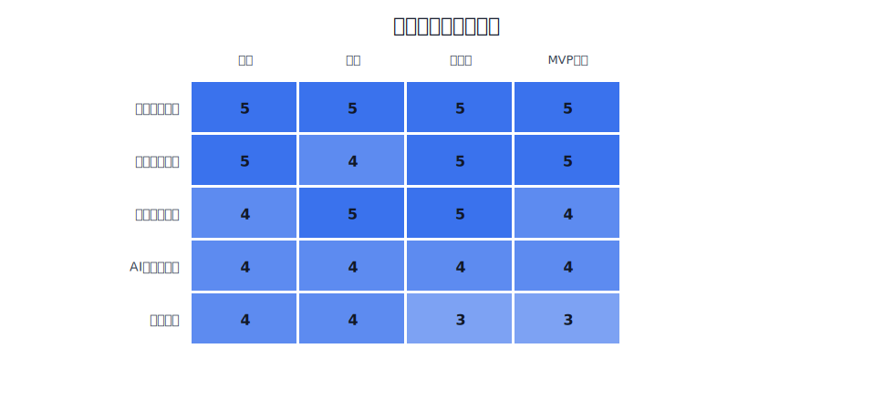

# AI 模拟面试官用户痛点与需求调研报告

生成日期：2026-05-10

## 执行摘要

本报告整合三轮公开调研，共计 456 条结构化研究输入：第一轮小红书公开面经 158 条，第二轮面试追问链与公开来源 204 条，第三轮需求验证样本 94 条。结论非常明确：目标用户不缺题库和资料，缺的是一个能围绕自己项目连续追问、暴露真实挂点并给出结构化复盘的训练产品。

首版产品应聚焦“中国本科生技术实习面试准备”，把输入限制为项目经历或简历片段，输出聚焦 3-5 轮追问后的挂点复盘。核心要解决的问题是：项目深挖崩盘、八股与项目割裂、AI 项目可信度风险、复盘不可执行。

## 1. 调研方法与样本边界

本次调研采用三阶段 desk research，而不是线下访谈。原因是挑战窗口只有 16 小时，真实访谈的招募、访谈和整理成本过高；公开面经、岗位 JD、开源项目和竞品体验已经能支撑 MVP 阶段的产品判断。

| 样本类型 | 数量 |
| --- | --- |
| 小红书面经 | 158 |
| 追问链样本 | 204 |
| 项目样本 | 36 |
| 岗位JD | 50 |
| 竞品体验 | 8 |

调研边界：

- 小红书内容只记录公开笔记的摘要和痛点标签，不记录 cookie、token 或个人隐私。
- GitHub/题库/JD 只作为公开能力需求和项目风险分析来源。
- 第三轮原始 JSON 只保留本地，不进入 Git；报告只沉淀统计和产品结论。
- 本报告用于 Product Memo 和产品设计输入，不声称具备统计学意义上的总体代表性。

## 2. 目标用户画像

首版目标用户是准备互联网大厂或 AI 相关技术实习面试的中国本科生。典型状态包括：

- 已经有一个或多个项目，但不确定是否经得起面试官追问。
- 正在背 Java/MySQL/Redis/MQ/计网/操作系统等八股，但不知道如何和项目结合。
- 做过 RAG、Agent、LLM Chatbot、AI 全栈应用，但担心被问“是不是只调 API”。
- 看了很多面经，能记录问题，但不知道自己真正挂在知识、表达、项目可信度还是工程细节。

## 3. 用户痛点分析

### 3.1 痛点总览

公开样本显示，用户的痛点不是“没有题”，而是训练方式无法逼近真实面试。真实面试不是静态问答，而是一个压力逐步加深的过程：从自我介绍或项目开始，抓住一个技术词或指标，不断追问为什么、怎么验证、失败怎么办、换约束怎么办。

### 3.2 核心痛点一：项目深挖崩盘

项目深挖是最强痛点。候选人经常能讲清“做了什么功能”，但讲不清：

- 项目背景和真实业务问题。
- 自己负责的模块和不可替代贡献。
- 技术选型为什么成立。
- 指标、压测、优化前后对比。
- 失败路径和线上排障。

这类问题直接决定首版产品的输入方式：不应该先让用户选题库，而应该先让用户粘贴项目经历。

### 3.3 核心痛点二：八股与项目割裂

小红书和追问链样本都显示，Java、MySQL、Redis、MQ、计网、操作系统仍然高频出现，但它们不是孤立存在。真实面试经常是：

- 你项目里用了 Redis？那缓存一致性怎么保证？
- 你说查询慢？Explain 看过哪些字段？
- 你引入 MQ？消息重复消费怎么幂等？
- 你说高并发？QPS、RT、错误率是多少？

因此，八股应该作为项目深挖的追问工具，而不是单独的背诵模块。

### 3.4 核心痛点三：AI 项目可信度风险

第三轮项目样本和 JD 样本都显示，RAG、Agent、LLM 应用已经成为实习候选人的高频项目包装方向。但这类项目尤其容易被问穿：

- 数据从哪里来，如何清洗、切块、更新？
- 检索失败如何定位，是 chunk、embedding、rerank 还是 prompt 的问题？
- Agent 是否真的有状态、记忆、工具调用和失败重试？
- 有没有评估集，指标是什么？
- 部署后如何控制成本、延迟、权限和安全？

这说明首版必须保留“RAG/Agent 项目真实性拷打”场景。

### 3.5 核心痛点四：复盘不可执行

用户往往能记录面试题，却不知道为什么答得不好。有效复盘至少要区分：

- 项目可信度不足。
- 专业深度不足。
- 表达结构混乱。
- 工程闭环缺失。
- 承压表现不稳定。
- 下一步该补项目、补八股、补表达还是补专项。

这直接定义了产品反馈维度。

## 4. 岗位与项目需求验证

第三轮调研补充了 36 条项目样本和 50 条 JD。它们说明首版产品的输入和场景设计是合理的。

| JD 方向 | 样本数 |
| --- | --- |
| AI应用 | 7 |
| AI全栈 | 1 |
| AI后端 | 7 |
| AI Infra | 5 |
| 算法 | 3 |
| LLM算法 | 14 |
| 后端 | 7 |
| 数据后端 | 4 |
| 平台后端 | 1 |
| LLM应用 | 1 |

JD 能力要求可以压缩为三类：

1. 后端工程能力：Spring/FastAPI、数据库、Redis、MQ、接口设计、部署、稳定性。
2. AI 应用能力：RAG、Agent、Prompt、OpenAI-compatible API、LangChain/LangGraph、服务化部署、日志与 profiling。
3. 大模型/AI Infra 能力：Transformer、LoRA/PEFT、vLLM、KV Cache、GPU/K8s、推理性能。

项目样本也呈现同质化风险：后台管理、商城、秒杀、RAG、Agent、知识库问答、LLM Web 应用最常见，最容易被问的不是“技术栈是什么”，而是“你真正做了什么”和“怎么证明有效”。

## 5. 面试追问模式

第二轮调研把真实面试问题抽象为追问链。最适合产品化的追问结构如下：

- 项目真实性链：项目背景 -> 个人贡献 -> 技术取舍 -> 指标 -> 失败路径。
- Redis 链：使用场景 -> key 设计 -> 缓存一致性 -> 击穿/穿透/雪崩 -> 降级。
- MySQL 链：慢 SQL -> 索引 -> Explain -> 锁/MVCC -> 数据量增长后的方案。
- MQ 链：为什么引入 -> 发送失败 -> 消费失败 -> 幂等 -> 顺序性 -> 堆积排查。
- RAG 链：数据来源 -> 切块 -> 检索 -> rerank -> 评估 -> 坏例归因。
- Agent 链：任务规划 -> 工具调用 -> 状态/记忆 -> 失败重试 -> 日志回放。

## 6. 竞品与替代方案缺口

替代方案大致分四类：

- 通用聊天机器人：能解释概念和生成题目，但不会稳定主动追问，也缺少固定评分结构。
- 海外 AI mock interview：有完整面试体验，但偏英语、海外岗位和完整招聘 pipeline。
- 题库/面经平台：资料多，但需要用户自己筛选、模拟和复盘。
- 开源 AI 面试项目：功能参考多，但大多是通用 mock 或招聘工具，不聚焦中国本科生技术实习项目深挖。

本项目的差异化不是“也能聊天”，而是中文技术实习语境下的项目驱动追问和挂点复盘。

## 7. 需要解决的问题与优先级

优先级最高的问题是：

1. 用户项目经不起连续追问。
2. 用户不知道自己回答挂在哪里。
3. 八股和专项知识无法迁移到项目场景。
4. RAG/Agent 等 AI 项目容易被认为只是包装。

对应的 MVP 需求是：

- 项目经历输入，而不是完整简历解析。
- 三个训练场景：项目深挖压力面、后端八股项目化追问、RAG/Agent 项目真实性拷打。
- 每次训练 3-5 轮连续追问。
- 结束后输出总评、风险点、项目可信度、专业深度、表达结构、工程闭环、承压表现和下一轮练习题。

## 8. 产品取舍

首版应该做：

- 文字交互。
- 项目经历/简历片段输入。
- 场景选择。
- AI 面试官连续追问。
- 结构化挂点复盘。

首版不应该做：

- 登录、数据库和历史记录。
- 语音和视频。
- 完整简历解析。
- 题库浏览器。
- 复杂招聘 pipeline。
- AI Infra 和算法/LLM 全方向深度覆盖。

## 9. Product Memo 可直接复用段落

我们观察到，中国本科生在技术实习面试准备中并不缺题目和资料，真正缺的是低成本、高频、接近真实面试的连续追问训练。公开面经和面试官视角都显示，真实面试往往从项目经历切入，再追问技术选型、失败路径、指标验证和迁移能力。通用聊天机器人可以解释概念，却不会稳定地抓住用户回答里的漏洞并持续追问；题库平台资料丰富，但无法针对用户自己的项目做动态复盘。因此，我们把 MVP 聚焦在“项目经历驱动的 AI 模拟面试官”：用户粘贴项目经历后，AI 连续追问并在结束后输出结构化挂点复盘，帮助用户知道下一轮到底该补项目细节、专业知识、表达结构还是工程闭环。

## 附录：关键公开来源示例

- JavaGuide：https://javaguide.cn/
- CS-Notes：https://github.com/CyC2018/CS-Notes
- doocs/advanced-java：https://github.com/doocs/advanced-java
- Doocs LeetCode：https://leetcode.doocs.org/
- AgentGuide：https://github.com/adongwanai/AgentGuide
- vLLM：https://github.com/vllm-project/vllm
- Dify：https://github.com/langgenius/dify
- RAGFlow：https://github.com/infiniflow/ragflow
- interviewing.io：https://interviewing.io/
- Steo AI：https://steo.ai/
